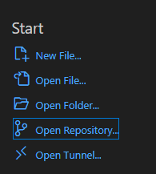
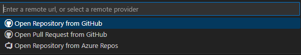
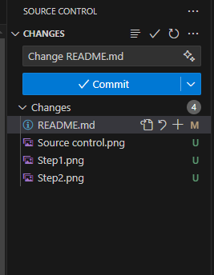

# A way to collaborate
Step -1: Create github account and write your github account in Zalo and wait to add to collaborators.

Step 0: Go to [vscode.dev](https://vscode.dev) or download Visual Studio Code.
Step 1: Open Repo.

Step2: Open Repo from Github

Step 3: Search 12.Ti11-N4 and open it.

If you have done step -1 through 3 correctly then you should have access to modify the files.

# How to push code (upload changes)
Step 1: Open source control

Step 2: Write commit message and press commit

# How to pull code (download changes)
At the bottom left, press the sync button (refress button)

#test